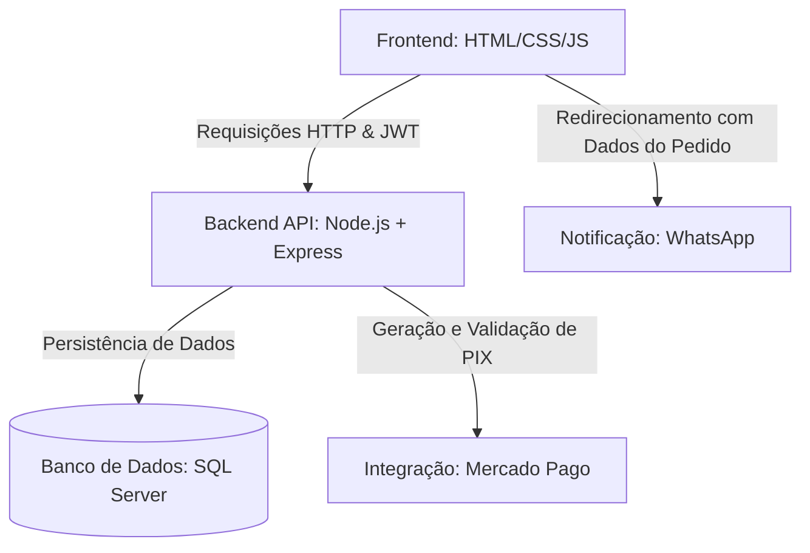

# Cardápio Online TCC II


Sistema web de pedidos online desenvolvido como Trabalho de Conclusão de Curso (TCC II), voltado para restaurantes e lanchonetes.

A aplicação contempla gerenciamento de cardápio em tempo real, processamento de pagamentos PIX integrado ao Mercado Pago, painel administrativo protegido por autenticação JWT e persistência de dados em SQL Server.

O projeto evoluiu de uma proposta acadêmica para uma aplicação funcional, preparada para utilização comercial em pequenos restaurantes e lanchonetes.

## Arquitetura do Sistema

O fluxo de informações e a integração entre as diferentes partes da aplicação seguem o modelo abaixo:



---

## Principais Funcionalidades

- **Cardápio Digital Interativo**: Interface responsiva para desktop e dispositivos móveis, com suporte a modo claro e modo escuro.
- **Carrinho de Compras**: Suporte para seleção de complementos (obrigatórios e opcionais) e adicionais de produtos com cálculo dinâmico de valores.
- **Montagem de Pizzas Fracionadas**: Interface modal para escolha de sabores fracionados, tamanhos e bordas.
- **Busca em Tempo Real**: Filtro instantâneo de itens do cardápio por digitação.
- **Controle de Horário de Funcionamento**: Status dinâmico da loja ("Aberto agora" ou "Fechado") com base em regras de horários configuradas.
- **Integração com Mercado Pago (PIX)**: Geração de QR Code e código Copia e Cola via API oficial do Mercado Pago, com atualização automática do status de pagamento.
- **Validação de Integridade de Transações (HMAC-SHA256)**: Assinatura de valores no backend para validação das requisições de pagamento, impedindo manipulações de preço no frontend.
- **Fila de Reenvio de Pedidos**: Fila de tentativas gerenciada com `node-cron` que reprocessa envios pendentes em caso de falhas de comunicação.
- **Painel Administrativo**:
  - Autenticação protegida por tokens JWT.
  - Controle de pedidos pendentes, enviados e com erro.
  - Alteração de preços e controle de disponibilidade de produtos em tempo real.
  - Estatísticas operacionais (faturamento total e do dia).
- **Banco de Dados SQL Server**: Armazenamento relacional estruturado com triggers para controle de data de atualização e índices otimizados para consultas de pedidos e produtos.

---

## Tecnologias Utilizadas

### Frontend

* HTML5
* CSS3
* JavaScript

### Backend

* Node.js
* Express.js

### Banco de Dados

* Microsoft SQL Server

### Integrações e Serviços

* Mercado Pago
* WhatsApp

## Diferenciais Técnicos

- **Segurança da Transação**: Validação de integridade de preços via assinatura HMAC no servidor para mitigar vulnerabilidades de modificação do DOM/HTML.
- **Arquitetura Resiliente (Fallback Local)**: Sistema que carrega a versão estática e local do cardápio caso o banco de dados SQL Server esteja temporariamente indisponível.
- **Autenticação Stateless**: Utilização de tokens JWT (JSON Web Tokens) com prazo de expiração para garantir segurança nas requisições administrativas.
- **Consistência Relacional**: Banco de dados estruturado com chaves estrangeiras, triggers de atualização automática e chaves únicas para evitar duplicidade de cadastros.

---

## Estrutura do Projeto

O repositório está organizado de forma simples, com o frontend na raiz e o backend em uma pasta dedicada:

- **Raiz do projeto (Frontend)**:
  - `index.html` / `app.js` / `style.css` - Página principal do cardápio digital do cliente.
  - `admin.html` / `admin.js` / `admin.css` - Painel administrativo.
  - `data.js` - Arquivo contendo as informações básicas da loja e do cardápio local (fallback).
- **`/server` (Backend Node.js & Express)**:
  - `index.js` - Ponto de entrada do servidor Express e rotas da API.
  - `db.js` - Conexão e queries utilizando o driver nativo (`msnodesqlv8`) ou `tedious` para o SQL Server.
  - `auth.js` - Middleware de validação do token JWT para rotas protegidas.
  - `token.js` - Geração e validação de tokens de segurança baseados em HMAC-SHA256.
  - `queue.js` - Fila de reenvio de pedidos utilizando `node-cron`.
  - `seed-db.js` - Script para criação das tabelas e importação inicial de dados diretamente do cardápio estático do frontend.
  - `database.sql` - Arquivo de definição do esquema (schema) do banco de dados SQL Server.
  - `package.json` - Gerenciamento de dependências de bibliotecas de terceiros.

---

## Como Executar o Projeto

### 1. Requisitos Prévios
- Node.js instalado na máquina.
- Microsoft SQL Server em execução (localmente ou na nuvem).

### 2. Configurando o Banco de Dados
1. Crie um banco de dados chamado `CardapioOnline` no seu SQL Server.

### 3. Configurando o Servidor Backend
1. Acesse o diretório `/server` e crie um arquivo chamado `.env` baseado nas seguintes variáveis:
   ```env
   ACCESS_TOKEN=seu_access_token_do_mercado_pago
   PORT=3001
   DB_SERVER=localhost\SQLEXPRESS
   DB_DATABASE=CardapioOnline
   DB_USER=seu_usuario_sql
   DB_PASSWORD=sua_senha_sql
   TOKEN_SECRET=chave_secreta_para_hmac
   JWT_SECRET=chave_secreta_para_jwt
   ```
2. Instale as dependências do projeto:
   ```bash
   cd server
   npm install
   ```
3. Inicialize as tabelas e insira os produtos iniciais a partir do arquivo `data.js` do frontend:
   ```bash
   node seed-db.js
   ```
   > Dica: Se quiser limpar tabelas antigas antes de semear, execute:
   >
   > `node seed-db.js --clean`
   
4. Inicie o servidor local Express:
   ```bash
   npm start
   ```

### 4. Executando o Frontend
- Como o frontend é composto por arquivos estáticos (`HTML`/`CSS`/`JS`), basta abrir o arquivo `index.html` diretamente em seu navegador (ou utilizando uma extensão como o *Live Server* no VS Code).
- O frontend identificará automaticamente se está rodando localmente (conectando ao servidor local na porta `3001`) ou se deve se comunicar com a API em produção hospedada na nuvem.

---

## Observação sobre Dados e LGPD

Em conformidade com a Lei Geral de Proteção de Dados (LGPD – Lei nº 13.709/2018), todos os dados informados pelos usuários durante a finalização do pedido destinam-se exclusivamente à demonstração do funcionamento da plataforma. Não há compartilhamento com terceiros e os dados do cliente podem ser salvos localmente via `localStorage` de forma segura, sob a opção explícita do próprio usuário.

---

## Demonstração

Abaixo estão algumas capturas de tela das principais funcionalidades do sistema.

### Página Inicial (Cardápio Digital)


### Carrinho de Compras


### Checkout PIX (QR Code & Timer)


### Painel Administrativo


---

## Autora

**Ana Júlia de Lima Aguiar Leite**

Desenvolvedora responsável pela análise, modelagem, implementação, documentação e testes do projeto Cardápio Online.

<a href="https://www.linkedin.com/in/anajulialimaleite/" style="text-decoration:none" target="_blank" rel="noopener noreferrer">
    
</a>

<a href="https://www.instagram.com/ajcriaredesenvolver/" style="text-decoration:none" target="_blank" rel="noopener noreferrer">
    
</a>

---

## Licença

Este projeto está licenciado sob a Licença Proprietária AJ - Criar e Desenvolver.

O código-fonte não pode ser redistribuído, comercializado ou utilizado para fins comerciais sem autorização prévia da autora.

[](./LICENSE)
